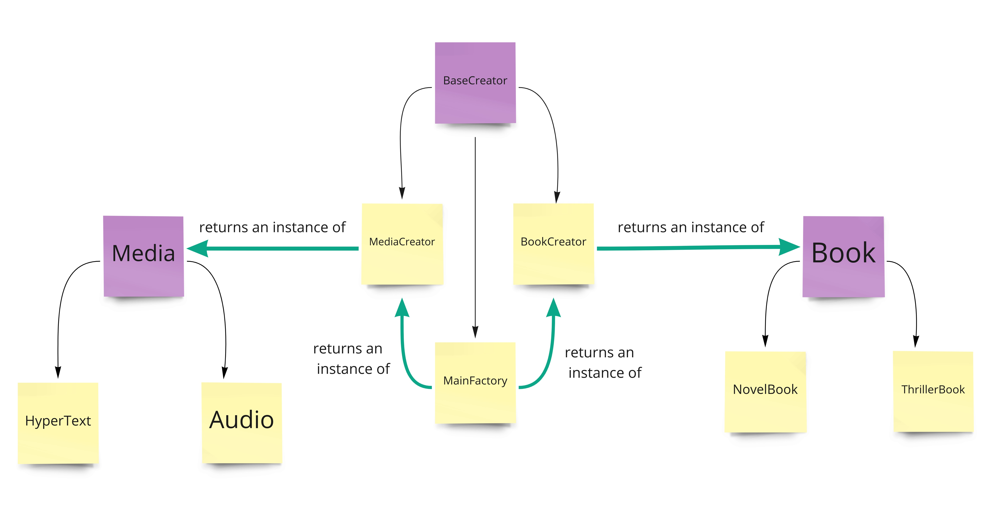

ABSTRACT FACTORY DESIGN PATTERN

This pattern is very similar to the factory pattern, with the sole difference that not only the product classes is subject to abstraction but also the factories themselves.

The outcome of this pattern is a factory generating another factory, it is used to create factories for a family of products with similar properties.

More complex implementations of this pattern can add interactions between the product families.

