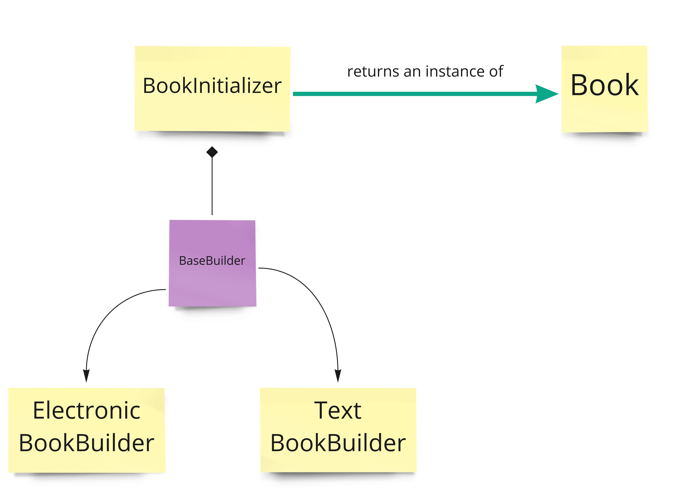

BUILDER DESIGN PATTERN

This design pattern is used mainly to prevent the telescopic constructor antipattern.
It consists in the creation of an "initializer" and a "builder" class, where the initializer class gives the
instructions to the builder one on how to properly initialize an object.

- Ideal in complex objects with many fields
- Allows to initialize an object coherently

