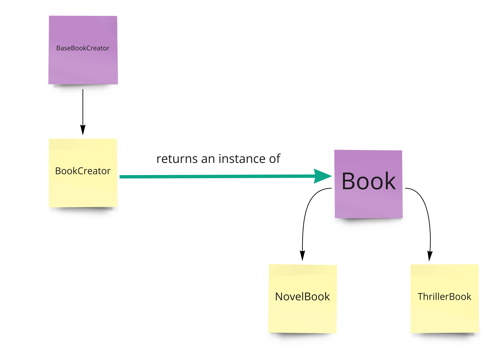

FACTORY DESIGN PATTERN

This design pattern is used when the client needs to be unaware of the specific type the Factory instance is producing.

- Favors method invocation instead of making direct constructor calls to create objects.
- Provides a centralized location for object creation code
- Encapsulates the client code from the object creation code

