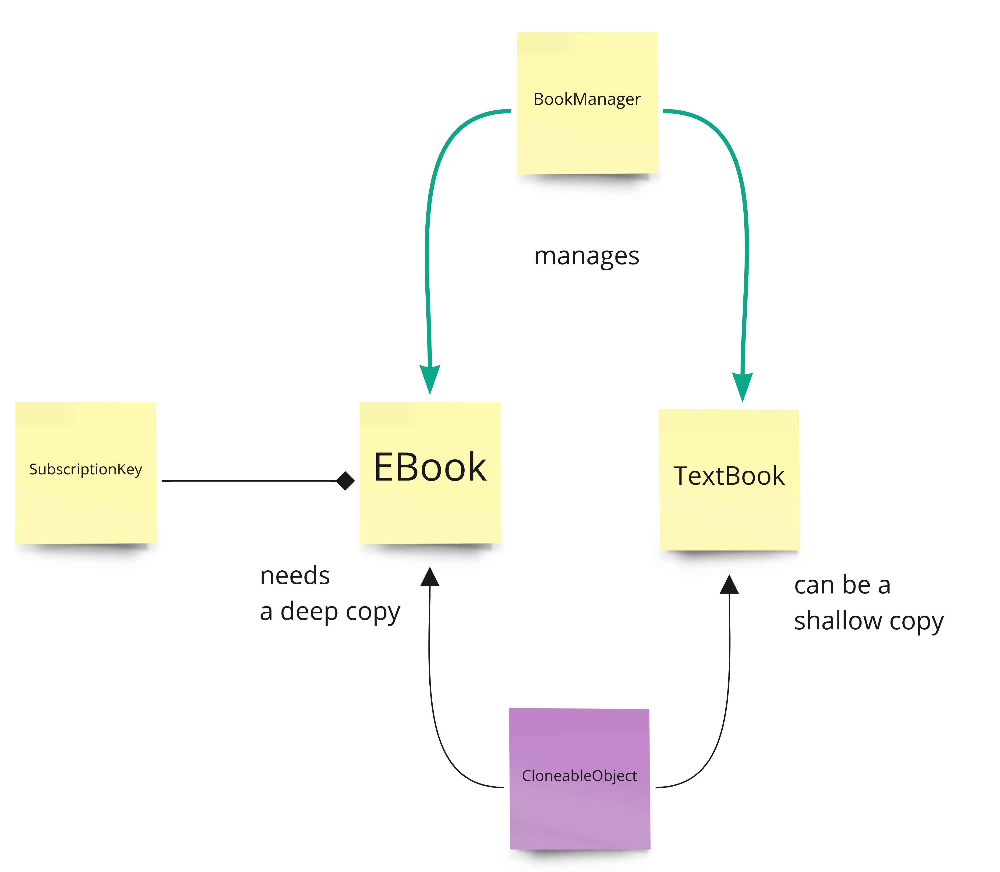

PROTOTYPE DESIGN PATTERN

This design pattern is used in case of larger objects for which cloning is less expensive than a new initialization.
The object can be cloned in a deep or shallow way.
A shallow copy copies only the primitive types associated to an object, while a deep copy copies also the referenced
instances of an object.

- Favors performances for very large objects with a consistent part that gets reused

